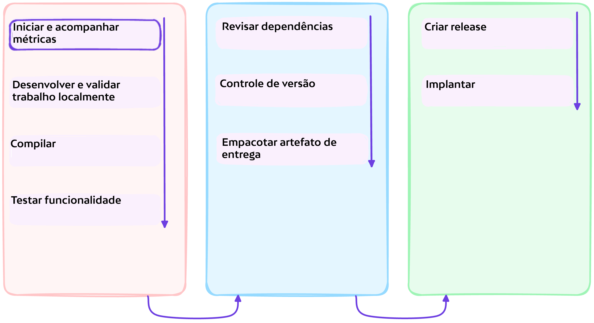

# :test_tube: Gerenciamento de Projetos

<!-- markdownlint-disable MD033 MD046 -->

!!! quote ":octicons-milestone-16: Facilitar o rastreamento colaborativo da entrega de objetivos de negócio"

    > _Como parte das etapas de pré-requisitos, você criou um quadro de gerenciamento de projeto. Agora você construirá a partir dessa etapa e manterá as partes interessadas informadas durante todo o processo de desenvolvimento._

    

---

## Exercício: Criar uma `issue` para capturar o objetivo

!!! question "O que são Issues do GitHub?"

    Use as Issues do GitHub para rastrear ideias, feedback, tarefas ou bugs para trabalho no GitHub.

    Quando você menciona uma issue em outra issue ou pull request, a linha do tempo da issue reflete a referência cruzada para que você possa acompanhar trabalhos relacionados. Para indicar que o trabalho está em andamento, você pode vincular uma issue a um pull request. Quando o pull request é mesclado, a issue vinculada é automaticamente fechada.

---

### **:material-numeric-1-circle: Consulte novamente o projeto criado no [pré-requisito para o workshop](../../prerequisites.md#criar-um-quadro-de-projeto-para-o-repositório)**

---

### **:material-numeric-2-circle: Criar uma issue para capturar o objetivo**

1. Identifique a coluna **:clipboard: Backlog**
2. Clique em **+ Adicionar item** na parte inferior da coluna
3. Clique no botão **+**
4. Selecione **:octicons-issue-opened-16: Criar nova issue** no menu
5. Escolha o repositório que você criou anteriormente
6. Escolha **Solicitação de recurso** (1)
    { .annotate }

    1. A criação da issue foi facilitada com um 👀 [**modelo de issue**](https://docs.github.com/pt/communities/using-templates-to-encourage-useful-issues-and-pull-requests/about-issue-and-pull-request-templates#issue-templates).

        ```markdown title=".github/ISSUE_TEMPLATE/feature_request.md"
        --8<-- ".github/ISSUE_TEMPLATE/feature_request.md"
        ```

7. Preencha o formulário. Sinta-se à vontade para ser criativo 🙂 com suas entradas.

    !!! example "Para o título..."
        Você pode, por exemplo, inserir "_**Criar um jogo de Tetris para encantar os visitantes do nosso site**_".

    Depois de preencher o formulário, clique em <span class="gh-button-green">Criar <span style="font-size: 0.75em">:material-apple-keyboard-command::material-keyboard-return:</span></span> para criar a issue. (1)
      { .annotate }

      1. As coisas que você pode fazer em uma issue incluem, mas não estão limitadas a
        - [**Atribuir**](https://docs.github.com/pt/issues/tracking-your-work-with-issues/assigning-issues-and-pull-requests-to-other-github-users) a issue para você mesmo ou outras partes interessadas.
        - [**Mencionar**](https://docs.github.com/pt/get-started/writing-on-github/getting-started-with-writing-and-formatting-on-github/basic-writing-and-formatting-syntax#mentioning-people-and-teams) outras partes interessadas (pessoas e equipes) para notificá-las.

---

### **:material-numeric-3-circle: Anote o número da issue**

Usaremos o número da issue para vinculá-la ao trabalho subsequente mais tarde. Se você estiver muito curioso e não puder esperar, veja 👀 [Vinculando um pull request a uma issue](https://docs.github.com/pt/issues/tracking-your-work-with-issues/linking-a-pull-request-to-an-issue).

Além disso, tendo criado a issue, podemos atualizá-la com comentários para manter as partes interessadas colaboradoras informadas.

---

## 📚 Recursos

- [Planejamento de projetos para desenvolvedores](https://github.com/features/issues)
- [Planejamento e rastreamento de trabalho para sua equipe ou projeto](https://docs.github.com/pt/issues/tracking-your-work-with-issues/planning-and-tracking-work-for-your-team-or-project)
- [Vinculando um pull request a uma issue](https://docs.github.com/pt/issues/tracking-your-work-with-issues/linking-a-pull-request-to-an-issue)
- [Criar diagramas para transmitir informações através de gráficos](https://docs.github.com/pt/get-started/writing-on-github/working-with-advanced-formatting/creating-diagrams)

---
